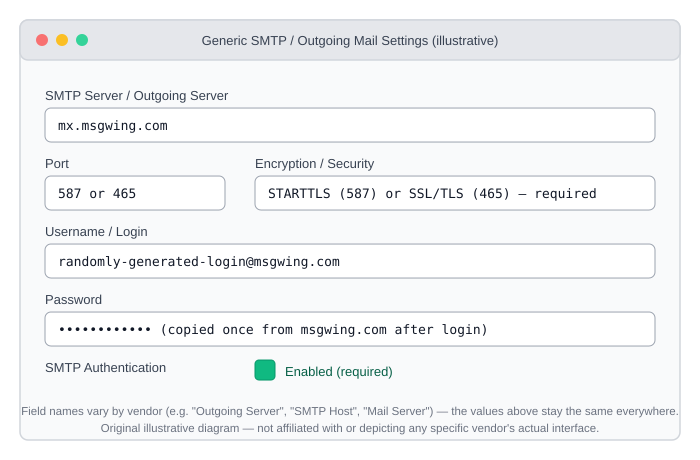
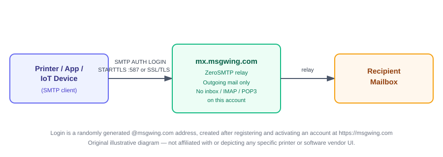
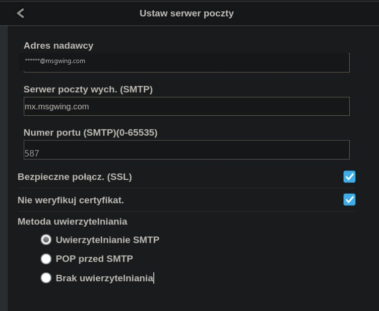
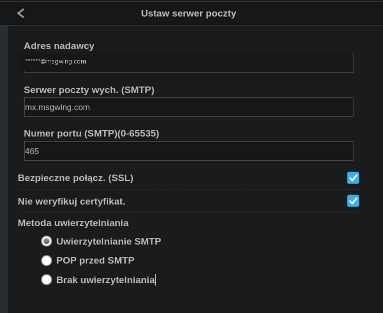

# Configuring Network Printers to Send Email via ZeroSMTP

ZeroSMTP is an **outgoing-only** SMTP relay: it lets a printer's "Scan-to-Email"
or "Scan-to-PC" feature send scanned documents by email. There is no inbox
associated with a ZeroSMTP account, so a printer configured this way can send
scans out, but cannot check or receive email.

## 1. Get your credentials

1. Register a free account at [msgwing.com](https://msgwing.com) and activate it.
2. While logged in, copy the randomly generated `@msgwing.com` username and password.
   They are shown once — store them securely (e.g. in the printer's own
   credential store, not in a shared document).

## 2. Connection values (same for every printer brand)

| Setting | Value |
| --- | --- |
| SMTP server / outgoing server | `mx.msgwing.com` |
| Port | `587` (STARTTLS) or `465` (SSL/TLS) |
| Encryption | STARTTLS on 587, or SSL/TLS on 465 — **required**, do not select "None" |
| Authentication | Enabled, method: LOGIN/PLAIN |
| Username | your `@msgwing.com` login |
| Password | your `@msgwing.com` password |
| From address | your `@msgwing.com` login (some printers require From == Username) |

> Prefer port `587` if the printer's menu only lists one port and one
> "use SSL/encryption" toggle — this is the most widely supported combination
> across printer firmware. Use `465` only if the printer explicitly offers an
> "SSL" (implicit TLS) mode separate from "STARTTLS"/"TLS".

## 3. Where to find these settings by brand

Menu wording changes between firmware versions, but the location is
consistent enough to be a reliable starting point. Always confirm against
your exact model's manual, since manufacturers do rename menus over time.

### HP (via the printer's Embedded Web Server / EWS)
`Settings → Networking → TCP/IP Settings` (to find the printer's IP), then in
a browser go to the printer's IP address →
`Networking` or `Scan` tab → `TCP/IP Settings` → `Outgoing Email` /
`Scan to Email` → `Outgoing Email Profiles` → add a profile with the values
from the table above.

### Canon (imageRUNNER / imageCLASS / PIXMA business models / Maxify)
Printer's web interface (Remote UI) → `Settings/Registration` →
`TX Settings` → `E-Mail/I-Fax Settings` → `SMTP Server Settings` → enter
server, port, authentication, and encryption values from the table above.
On the **Maxify MB2755**, this same menu also has an SSL certificate
verification toggle — see the
[known exception below](#4-known-exception-canon-maxify-mb2755-requires-disabling-certificate-verification)
if it needs to be turned off.

### Epson (WorkForce / EcoTank Pro with Scan-to-Email)
Printer's web configuration page → `Network Scan` or `Basic` → `Email Server` →
enter server address, port, and authentication settings from the table above.

### Brother
Printer's web management page (Web Based Management) → `Network` →
`Protocol` → `SMTP Client` → enter server, port, and authentication values
from the table above. Set `SSL/TLS` to `STARTTLS` for port 587 or `SSL` for
port 465.

### Xerox / Konica Minolta (typical enterprise MFPs)
Device web UI → `Properties` / `System Settings` → `Connectivity` →
`Protocols` → `SMTP Server` → enter server, port, authentication, and
encryption values from the table above.

## 4. Known exception: Canon Maxify MB2755 requires disabling certificate verification

Most printers validate `mx.msgwing.com`'s certificate correctly and should be
left with certificate verification **enabled** — this is the safe default
and the one recommended in [TROUBLESHOOTING.md](TROUBLESHOOTING.md). One
confirmed exception is the **Canon Maxify MB2755** (2016-era consumer/SOHO
inkjet MFP):

- `mx.msgwing.com` serves a **Let's Encrypt R3** certificate.
- Until September 2021, Let's Encrypt's chain was cross-signed by the
  widely trusted `DST Root CA X3`. Since that root expired, Let's Encrypt
  relies solely on its own `ISRG Root X1`.
- The MB2755's firmware ships a fixed, non-updatable root CA store that was
  never updated to trust `ISRG Root X1`. As a result, full certificate
  validation fails on this model even though the certificate itself is
  valid and correctly served — there is no way to import a root certificate
  into this printer's firmware, and no firmware update exists that adds it.
- On this specific model, disabling **"Nie weryfikuj certyfikat" / "Don't
  verify certificate"** is the only setting that lets the connection
  succeed. Everything else (server, port, SSL, authentication) uses the
  same values as the table above.
- **Update (production testing, 2026-07):** this printer also connects
  successfully to `mx.msgwing.com` on port **`587`** with **"Bezpieczne
  połącz. (SSL)" / "encrypted connection"** checked (same certificate
  exception applies, since the root cause is the printer's fixed CA store,
  not the port). **Port `587` should be treated as the default for this
  model going forward; keep port `465` configured only as a fallback if
  `587` is ever unreachable on a given network** (see "Which port should I
  use?" in [TROUBLESHOOTING.md](TROUBLESHOOTING.md#which-port-should-i-use)).

Port 465 (fallback configuration only)

> **Security note:** disabling certificate verification means the printer
> no longer confirms it's actually talking to `mx.msgwing.com` rather than
> an on-path attacker on the same network (the SMTP session is still
> encrypted, but the server's identity is unverified). Only do this if your
> device is genuinely affected by the root-CA gap above — for any printer
> that isn't an old Canon Maxify (or a similarly outdated embedded device),
> keep certificate verification enabled per
> [TROUBLESHOOTING.md](TROUBLESHOOTING.md#certificate--tls-verification-failed).

## 5. Verifying it works

1. Send a test scan-to-email from the printer to your own inbox.
2. If it fails, check the printer's event log for an authentication or TLS
   error, and re-verify the values in the table above (a common mistake is
   picking "None" for encryption, which ZeroSMTP does not allow).
3. For deliverability/reputation testing (SPF/DKIM/DMARC), see the root
   [`SendEmailTest_mail-tester.com.ps1`](../SendEmailTest_mail-tester.com.ps1)
   script and the "Verify Your Domain Reputation" section in the
   [README](../README.md).

## Limitations

- Send-only: no IMAP/POP3, no inbox, no "receive" test.
- One authenticated `@msgwing.com` account = one From address; printers
  that require a different From address for each user should use a
  shared queue or app-level relay (see [APPS.md](APPS.md)) instead of
  configuring dozens of individual printers.
