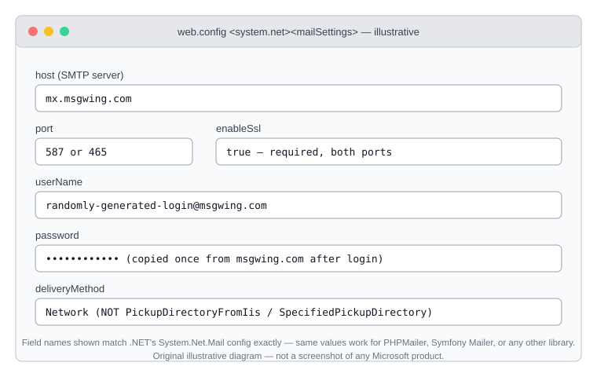

# Windows Server Setup Guide

> **Heads up about the classic "IIS SMTP relay" approach:** Microsoft's own
> documentation on [configuring SMTP e-mail in IIS](https://learn.microsoft.com/en-us/iis/application-frameworks/install-and-configure-php-on-iis/configure-smtp-e-mail-in-iis-7-and-above)
> starts with a note that the IIS 6.0 SMTP Virtual Server component it
> describes **has been unsupported since Windows Server 2003/2008**
> ("we no longer support doing so with IIS SMTP"). It still technically
> installs on modern Windows Server via the legacy IIS 6 Management
> Compatibility feature, but it's not something to build a new setup on.
> The modern equivalent — connecting directly to `mx.msgwing.com`, no local
> relay component needed — is the recommended approach below.

## Top pick: point your app straight at ZeroSMTP (no local relay needed)

You don't need any Windows feature installed at all — ASP.NET, classic
ASP, and PHP-on-IIS applications can talk to `mx.msgwing.com` directly.

### ASP.NET / IIS-hosted apps (`web.config`)

Add this to the application's `web.config` (or `machine.config` for a
server-wide default):

```xml
<configuration>
  <system.net>
    <mailSettings>
      <smtp deliveryMethod="Network" from="your-username@msgwing.com">
        <network
          host="mx.msgwing.com"
          port="587"
          enableSsl="true"
          userName="your-username@msgwing.com"
          password="your-password" />
      </smtp>
    </mailSettings>
  </system.net>
</configuration>
```

For port 465 (implicit SSL/TLS) instead of 587 (STARTTLS), set `port="465"` —
`enableSsl="true"` covers both, .NET negotiates the right handshake for
each port automatically.

Don't hardcode the real password in `web.config` in source control — use
[ASP.NET's configuration encryption](https://learn.microsoft.com/en-us/aspnet/core/security/app-secrets)
or environment-specific config transforms for production.

### PHP on IIS

Use [PHPMailer](../php-zerosmtp.php) or [Symfony Mailer](../php-symfony-mailer-zerosmtp.php)
from this repo and point them at `mx.msgwing.com:587`/`:465` directly — no
IIS-level SMTP configuration needed. This also sidesteps PHP's very
limited built-in `mail()` function, which doesn't support authenticated
SMTP at all.

## For scheduled/background tasks: PowerShell + Task Scheduler

For backup jobs, monitoring alerts, or anything else that isn't a web app,
use [`pwsh-zerosmtp.ps1`](../pwsh-zerosmtp.ps1) from this repo (built on
the actively maintained `Send-MailKitMessage` module — see that file for
why, not the deprecated `Send-MailMessage` cmdlet) as a
[scheduled task](https://learn.microsoft.com/en-us/windows-server/administration/windows-commands/schtasks-create):

```powershell
$env:ZEROSMTP_USERNAME = "your-username@msgwing.com"
$env:ZEROSMTP_PASSWORD = "your-password"
schtasks /create /tn "ZeroSMTP test" /tr "pwsh.exe -File C:\path\to\pwsh-zerosmtp.ps1" /sc daily /st 08:00
```

Store real credentials as a scheduled-task-scoped environment variable or
via `Register-ScheduledTask` with a secured credential object — not in
plain text in the task definition.

## Legacy: the classic IIS SMTP relay (not recommended for new setups)

If you're maintaining an old application that only supports "deliver to
local SMTP server" and can't be reconfigured to connect directly, the
[Microsoft doc linked above](https://learn.microsoft.com/en-us/iis/application-frameworks/install-and-configure-php-on-iis/configure-smtp-e-mail-in-iis-7-and-above)
covers installing the legacy **SMTP Server** Windows feature and
configuring it (via the IIS 6.0 Manager console) as a relay:
`Properties → Delivery → Outbound Security` (basic auth with your
ZeroSMTP username/password) and `Delivery → Advanced → Smart host` set to
`mx.msgwing.com`, with outbound port 587 or 465 configured under
`Outbound connections`. Given Microsoft's own unsupported-since-2008
notice, treat this as a last resort, not a starting point.

## Connection reference



## Verifying it works

The [`check-connection.ps1`](../check-connection.ps1) script in this repo
works identically on Windows Server — run it first to confirm the network
path to `mx.msgwing.com` is open before debugging application config. See
[TROUBLESHOOTING.md](TROUBLESHOOTING.md) if it isn't (Windows Server on
some cloud providers is subject to the same outbound port blocking as
Linux VMs).
